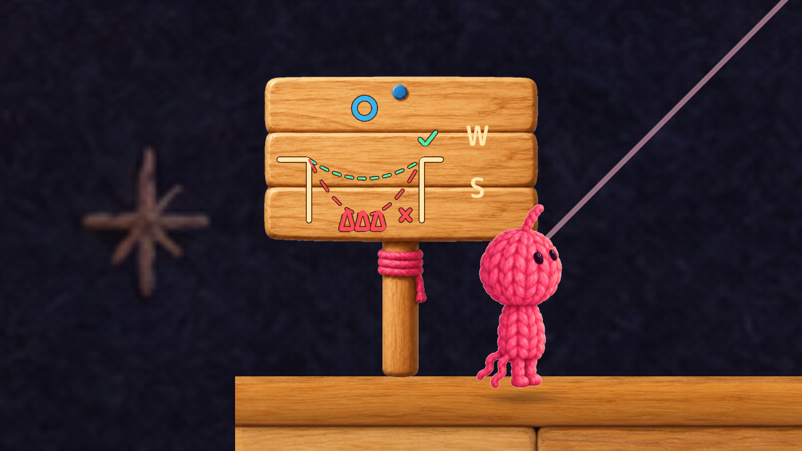
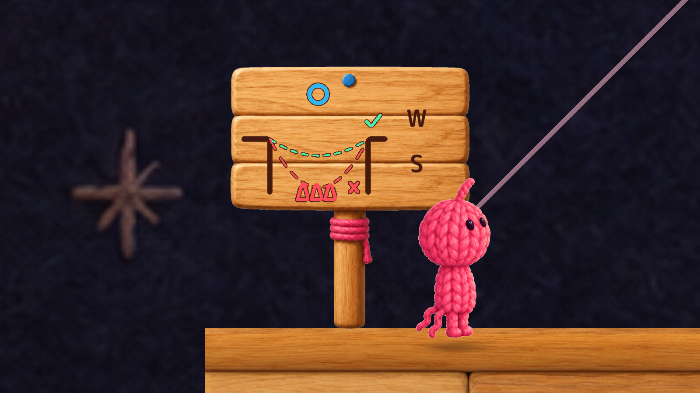

# H1 — Tutorial Sign Readability

## 原因と範囲

TutorialSignInscription の `Operation Key E/W/S/Q/F` TextMeshがCream（RGBA約1/.91/.678/1）でした。ゲーム内の `Craft Guide Sign Full Canvas` は明るい蜂蜜色の木板で、白に近い字が背景になじんでいました。図のLeft/Right Bank、Shelf、Arrowの前景線にも同じCreamが使われています。

図のラベルはLineRendererの名前であり、独立した白い説明文ではありません。全画面TutorialSectionGuideの本文・diagramLabelStyleはdark ink系のままです。全画面の文字色は変更していません。

実Runtimeで看板1〜4のキーを確認し、近景・通常カメラを記録しました。看板2のW横にある木板の20×20px領域と指定前景色による概算コントラストは **2.10:1 → 5.91:1**（Evidence/contrast.json）。描画画像の木目をサンプルした概算であり、厳密なUIアクセシビリティ認証値ではありません。

## 最小修正

Creamを不透明な濃茶のDiagramInk（.27/.10/.055/1）へ変更し、Operation Keyと上記の前景線だけに使用。Ink輪郭、青・緑のリング、危険色、毛糸テクスチャ、アニメーション、文字サイズ64・配置・画像は維持。

## BEFORE / AFTER

有効な修正前スクリーンショットは **Evidence/BeforeSigns/**、修正後は **Evidence/After/** です。各フォルダーの `sign_1..4_world.png` と `sign_1..4_detail.png` を参照してください。

例（看板2）：

Camera.Renderの実ゲーム内描画です。worldは実カメラ、detailは確認用拡大で、どちらも看板そのものの寸法は変更していません。比較のため看板絵の時計を0秒に合わせており、絵がまだ現れない部分はアニメーションの開始状態です。既存アニメーションを削除したわけではありません。

初回Evidence/Before/の看板画像は診断側でコンポーネントをdisableし、OnDisableが図を消したため **H1の証拠として無効**。元コードのままdisableしない撮影へ修正しBeforeSignsで再取得しました。初回データは透明性のため削除せず保持しています。初回のH2・H3計測はこの看板表示固定と独立です。

判定：H1の原因確認・表示修正・Runtime比較 **PASS**。Humanの読感追試は未実施。
