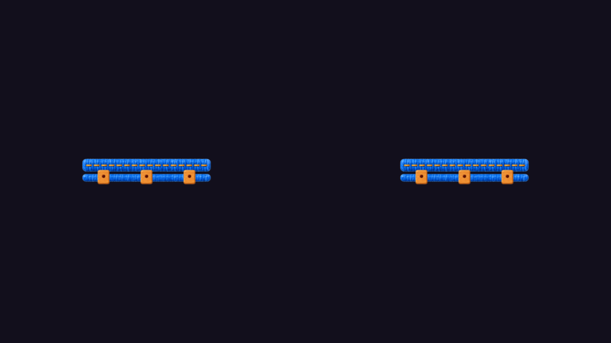
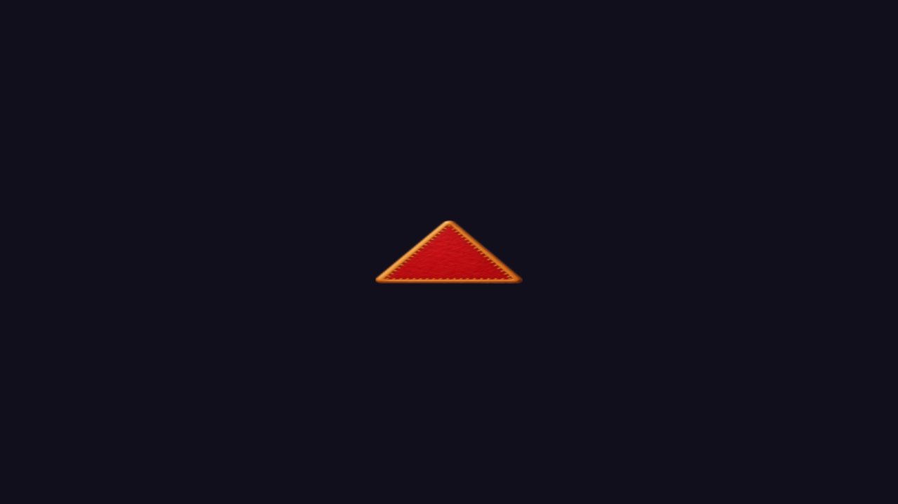

# Visual A/B

条件：同一D3D11、orthographic Camera、1280×720。snapshot後に隔離projectの対象だけを診断layer 30へ移し、背景・UI等の非対象を除外してCamera.RenderからPNG保存。原本のlayer/Camera/UIを変更したものではない。これは同条件の局所renderであり、Human操作中の全画面Screenshotではない。

| 局所対象 | Camera center | Orthographic size | 違うpixel | PNG SHA一致 |
| --- | --- | --- | --- | --- |
| S05左右Rails | (97.3, -0.95) | 4 | 0 | YES |
| S02 Front Spike | 対象rootのworld位置 | 1.2 | 0 | YES |
| S02 Far Spike | 対象rootのworld位置 | 1.2 | 0 | YES |

`Evidence/visual_comparison.json`に各画像のSHA、解像度、diff bboxを記録。RGB pixel diffは全組0、さらにPNGバイトSHAも各組一致。空画像ではなく、実際にクラフト青レールと木製Tie、赤フェルト棘が描画されていることを目視確認した。鑑賞上の良否・Human Art PASSは判定していない。

## Rails

## Spike

Front画像は同Evidence内の`S02_FrontSpike.png`。原本画像の再編集・背景の素材生成はしていない。

## Human-approved状態との関係

既存Human追試Build `HumanPlaytestFixes_20261001_065300`はWorking Treeから作成され、そのH1/H2/H3/S2はユーザーが全項目採用済み。既存copy/build manifestと今回のScene SHAは一致する。したがって過去にHuman確認された入力Sceneは**B**。

ただしH1/H2/H3/S2承認には、この局所レール・棘を改めてArt PASSしたという個別記録はない。今回の証拠から言えるのは、最新Sourceを使うAの対象起動後表示もBと等しいこと。A側を新たにHuman-approvedと呼び換えない。
