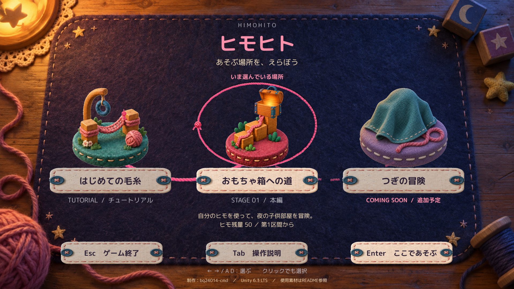
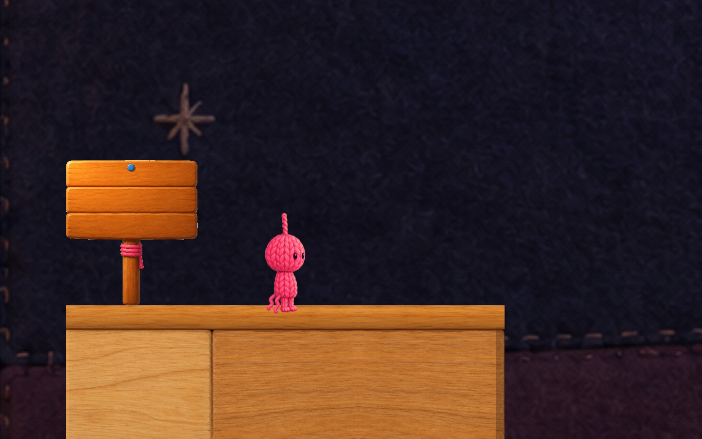

# ヒモヒト — 自分のヒモで、道をつくる

夜の子供部屋を舞台に、毛糸の身体を持つ主人公がおもちゃ箱を目指す、Unity製の2Dアクションパズルです。
ヒモをフックへ掛けて振り子で渡り、必要な場所では身体の一部をヒモ橋として残します。
「長さを選んで移動すること」と「限られた身体をどこで使うか」が遊びの中心です。



**最終更新：2026年9月11日**

| 項目 | 内容 |
| --- | --- |
| ジャンル | 2Dアクションパズル／1人用 |
| 対象 | Windows 64bit・キーボード操作 |
| 開発環境 | Unity 6.3 LTS `6000.3.21f1` |
| 使用言語・入力 | C#／Built-in Input Manager |
| 実装済み | チュートリアル4区間＋本編1ステージ・9区間 |
| 制作 | bq24014-cmd（生成AIの利用範囲は後述） |

このリポジトリは、作品のソースコード・素材・制作記録を公開するものです。ブラウザで直接遊べるWeb版ではありません。
実行ファイルはソースのZIPには含まれません。Windows配布版をお持ちの場合は、下の「配布版の遊び方」を参照してください。

## 作品の見どころ

- **振り子で渡る**：掛ける位置、ヒモの長さ、加速と解除のタイミングで渡り方が変わります。
- **身体を道として残す**：移動に使うヒモを橋へ変えると残量が減ります。長い橋ほど身体を使うため、移動の安全さと残量を考えて進みます。
- **作った道を組み替える**：中央フックを外して2本の橋を1本にまとめ、低い梁をくぐる道へ変えられます。
- **看板で見て学ぶ**：チュートリアルでは看板上の小さな絵が動き、Zで開く説明も「操作→変化→結果」の順に動きます。
- **手作りの世界と反応**：フェルトの壁、木の足場、毛糸のフック、布巻きレールに質感を統一。主人公の動作やヒモの編み上がり、足元のしなりで操作の結果を伝えます。
- **自分が残した道を振り返る**：クリア画面には、実際に残った橋と床を簡略化した見取り図を表示します。



画像は開発中の実装確認画面です。個別の素材・演出の確認画像は、末尾の制作資料から参照できます。

## 配布版の遊び方

1. Windows版のZIPを「すべて展開」します。
2. 展開したフォルダーの `START_HIMOHITO.bat` を起動します。
3. ステージ選択で「はじめての毛糸」を選び、Enterで開始します。本編も最初から選択できます。

Unityのインストールは不要です。`Game` 内のexeだけを取り出さず、ランチャー・データを含むフォルダー一式を保持してください。

ランチャーは、日本語を含む実行パスでシーン遷移が停止した問題への対策として、ゲーム一式を `%PUBLIC%\HimoHitoPrototype`（通常は `C:\Users\Public\HimoHitoPrototype`）へコピーして起動します。起動のたびに差分をコピーするため、初回は少し時間がかかります。
`Game/HimoHitoPrototype.exe` の直接起動は避けてください。

既定は1920×1080の全画面ウィンドウです。`Alt + Enter` でウィンドウ表示へ切り替えられます。
BGMと効果音の音量は、プレイ中にEscで開くポーズ画面から個別に調整できます。

## 基本ルール

### ヒモを掛ける・橋にする

1. 未接続の状態でW／Sを押し、次に使うヒモの長さを選びます。選択範囲は整数1～14で、現在の残量が上限になります。
2. 矢印キーでフックを狙い、Eで接続します。通常の接続・解除や振り子移動だけでは残量は減りません。
3. 対応する2点式フックへ接続中にQを押すと、選択した長さを消費してヒモ橋を作ります。生成後も残量を最低1残す必要があります。
4. 2本の橋が集まる中央フックは、未接続で照準を合わせてFを押すと外せます。2本の長さを合算した1本の橋になり、追加消費はありません。

青いフックは主に振り子用、緑のフックは橋作成用です。チュートリアル最終区間・本編第9区間の青い中央フックは、橋をつなぎ、Fで外すための兼用フックです。
Q／Fは、それぞれを使う区間まで進むと利用できます。

橋は、選択長が対になるフック間の直線距離以上なら作成できます。余分な長さは、消費量と下向きのたわみに反映されます。
チュートリアル第3区間の推奨長は **7**、最終区間の2本は **各6** です。推奨どおりなら残量は `99 → 92 → 80` になります。

### 接続・移動の制限

- 接続先は専用フックだけです。床・壁・梁・生成済みの橋や、何もない空間には掛けられません。
- 新規接続は原則として接地中に行います。本編第6区間の連続青フックだけは、解除後1.5秒以内に次のフックへ空中再接続できます。
- ジャンプは未接続・接地中に行います。二段ジャンプはなく、ヒモ接続中もジャンプできません。
- フック自体は歩行を遮りません。生成した橋と通常床の境目は、地上歩行中に小さな段差を越えられるよう補正しています。
- トゲや懐中電灯の危険範囲へ接続中の主人公が触れると、ヒモが外れます。

照準先が接続可能になると、フックの目印が強調され、表示上の照準が吸い付きます。
照準線はフック位置で打ち切らず、選択した長さだけ伸びるので、W／Sでの違いも確認できます。

## 操作

### プレイ中

| キー | 操作 |
| --- | --- |
| A／D | 左右移動・振り子の加速 |
| Space | 未接続・接地中のジャンプ |
| W／S | 未接続時、次に使う長さを1ずつ増減 |
| ←／→ | 照準を回転 |
| ↑／↓ | 照準を真上／真下へ合わせる |
| E | フックへ接続／接続中のヒモを解除 |
| Q | 対応するフックへ接続中、ヒモ橋を生成 |
| F | 未接続で中央フックを狙い、2本の橋を統合 |
| F（本編第3区間のスイッチ付近） | 戻り足場を出す |
| R | 現在区間のチェックポイントから再挑戦 |
| Z（チュートリアルの看板付近） | 区間の説明を開く／閉じる |
| Tab | 操作説明を開く／閉じる |
| Esc | ポーズを開く／閉じる |

マウス照準は補助入力として利用できます。ステージ紹介カメラはSpace／Enterでスキップできます。

### メニュー・結果画面

| 場面 | 操作 |
| --- | --- |
| ステージ選択 | ←／→・A／Dで選択、Enterで開始、Tabで説明、Escでゲーム終了 |
| ポーズからステージ選択へ | 「ステージ選択へ」またはT → 確認画面でEnter。Escで取り消し |
| 失敗画面 | Rで現在区間から再挑戦、Escでステージ選択へ |
| チュートリアルのクリア画面 | Enterで本編へ、Rでチュートリアル最初から、Escでステージ選択へ |
| 本編のクリア画面 | Rで本編最初から、Escでステージ選択へ |

表示されているメニューボタンはクリックにも対応します。説明画面を開いているときのEscは説明を閉じる操作です。
失敗・クリア画面は、表示後にプレイヤーが操作するまで切り替わりません。Unity Editorでのゲーム終了はPlayモードの停止になります。

## ステージ・進行・保存

| ステージ | 内容 | 初期残量 | 初期選択長 |
| --- | --- | --- | --- |
| はじめての毛糸 | チュートリアル4区間 | 99 | 6 |
| おもちゃ箱への道 | 本編9区間 | 50 | 7 |
| つぎの冒険 | 追加予定の案内。現在は開始不可 | — | — |

チュートリアルは「振り子で渡る」「長さを選ぶ」「橋を作る」「2本を1本にまとめる」の順に学びます。
区間到達時に選択長を推奨値へ自動変更せず、プレイヤーが選んだ長さを引き継ぎます。

本編には、上下のフックと戻り道、橋による遮光、安全な橋と残量を節約する振り継ぎの分岐、中央フックを外す仕掛けがあります。
開発時の区間番号を保持しているため、**第1～7・9・10区間の計9区間**です。第8区間は設計見直しで削除され、第7区間から第9区間へ進みます。
「追加予定」は未実装の予告であり、クリアによる解放条件や公開日は設定していません。

- **チェックポイント**：指定床の内側に入り、上面へ安定して着地すると更新します。側面・裏面・角への接触だけでは更新しません。
- **再挑戦**：位置・残量・選択長・生成済みの橋を、その区間のチェックポイント時点へ戻します。
- **本編の補充**：区間到達時、残量が次区間の指定下限を下回る場合だけ下限まで補充します。毎区間50へ全回復する仕組みではありません。
- **終了後も保存するもの**：ステージID別のクリア印と、BGM／効果音の音量設定。
- **終了後は保存しないもの**：途中区間、残量、橋、クリア結果の見取り図・時間。ステージ選択へ戻った後の新規開始も第1区間からです。

クリア印はステージ選択の毛糸旗とCLEARタグへ反映されます。未クリアのチュートリアル・本編も最初から自由に選べます。

## 現在の演出・画面

- ステージ選択では、選んだ島を毛糸が囲みます。練習の島では主人公が橋を歩き、本編の島では宝箱が開きます。
- 開始時は毛糸で紺色の布を引いて画面を覆い、その後、ゴールからスタートへ戻る紹介カメラを再生します。
- 背景は遠景と中景を分けた控えめな視差表現です。通常カメラに速度連動のズーム・揺れ・回転は付けていません。
- 主人公は歩行・待機・照準・ジャンプ・着地・振り子・壁押し・スイッチ押し・橋生成・ゴールなどで姿勢を切り替えます。振り子のポーズは速度に追従します。
- 接続時は頭からヒモが伸び、フックへ結び付きます。解除時は頭へ戻り、Qでは橋が編み上がり、Fでは中央がほどけて1本になります。
- 橋は歩行・ジャンプ・着地に合わせて見た目がしなります。身体は残量に応じて小さくなりますが、プレイヤーの当たり判定は変えません。
- 木の床、フック、トゲ、看板にも小さな反応を付けています。落下時はほどけ、再挑戦時は約0.8秒で編み戻ります。
- 宝箱は近づくと開いて中が光り、離れると閉じます。ゴール確定後は主人公の仕草を見せ、1.35秒後にクリア音と結果画面へ移ります。
- HUDは区間・残量・木製ゲージ・選択長を中心に整理し、詳しい操作をTab、区間の説明をZへまとめています。

## Unityでソースから実行する

### 必要なもの

- Unity HubとUnity `6000.3.21f1`
- GitとGit LFS
- Windows版を作る場合は、対応するWindows Build Support
- 完全な音付きビルドには、下記のBGMファイル

```sh
git lfs install
git clone https://github.com/bq24014-cmd/himohito-prototype.git
cd himohito-prototype
git lfs pull
```

一部の音源はGit LFSで管理しています。GitHubのソースZIPではなく、LFSを有効にしたcloneを推奨します。

1. Unity Hubからcloneしたフォルダーを追加し、指定バージョンで開きます。
2. 下記のBGMを配置し、Unityのインポートとコンパイルが完了するまで待ちます。
3. `Assets/Scenes/Tutorial.unity` を開き、`HimoHito > Play From Tutorial` を選びます。
4. Playを押します。ステージ選択からチュートリアル／本編を開始できます。

BGM未配置でもEditorでの実行は警告とともにBGMなしで継続しますが、**Windowsビルドは停止します**。

#### BGMの別途配置

「優しい踊り」／GANOの[公式配布ページ](https://dova-s.jp/bgm/detail/3126)からトラック1を取得し、
`Assets/Resources/Audio/YasashiiOdori.mp3` として配置してください。
このファイルは音源単体の再配布を避けるためGit管理外です。`.meta` と再生コードは同梱しています。
配布元の利用条件も、末尾の「素材・ライセンス」から確認してください。

#### 編集時の見た目・開発用設定

Sceneビューの表示更新は `HimoHito > Preview > Refresh Scene Visuals` で行えます。
既存の `Rebuild...`／`Clean...` メニューは開発用の再構築・整理処理であり、通常の起動には不要です。保存シーンを変更するため、試す場合は先に変更を保存・退避してください。

途中区間やゴール付近から開始するInspectorの開発用フラグは、通常プレイでは無効にします。
`Play From...` は開始シーンを指定するメニューであり、シーン内の開発用フラグを自動で初期化するものではありません。

## Windows版をビルドする

1. BGMがAudioClipとしてインポートされていることを確認します。
2. 必要な旧ビルドがあれば、`Builds/Windows` の外へ退避します。**ビルダーは既存の同フォルダーを削除して作り直します。**
3. `HimoHito > Build Windows Prototype` を実行します。
4. 成功後、`Builds/Windows` をフォルダー一式でZIPにします。

出力には `START_HIMOHITO.bat`、起動説明、`Game/HimoHitoPrototype.exe` と必要なデータが含まれます。
exe単体や生のBGMだけを共有せず、ゲームとして組み込まれた配布物を共有してください。
提出用の作品解説PDFは、完成した配布フォルダーとともに提出ZIPへまとめます。

ビルド対象のシーンはステージカタログから取得します。現在はTutorialとMainStageの2つで、追加予定の枠は含みません。
`Builds/`、`Library/`、`Temp/`、`Logs/`、`UserSettings/` はGit管理外です。

## 実装の構成・工夫

| 分野 | 主なコード | 内容 |
| --- | --- | --- |
| ヒモ残量 | [RopeResource.cs](Assets/Scripts/RopeResource.cs) | 残量を1か所で管理し、操作とHUDが同じ値を参照 |
| 接続・振り子 | [RopeController.cs](Assets/Scripts/RopeController.cs)、[PlayerMover.cs](Assets/Scripts/PlayerMover.cs) | DistanceJoint2Dの拘束と接線方向への加力。通常解除では移動の勢いを維持 |
| ヒモ橋 | [RopePlatformBuilder.cs](Assets/Scripts/RopePlatformBuilder.cs) | 2点間の橋生成、長さに応じた曲線、EdgeCollider2D、中央フック除去と統合 |
| 見た目 | [RopeBodyVisual.cs](Assets/Scripts/RopeBodyVisual.cs)、[CraftPlayerArt.cs](Assets/Scripts/CraftPlayerArt.cs) | ポーズ・頭頂・足裏を合わせたアニメーションと、表示を物理から分けた反応 |
| チュートリアル | [PrototypeRunController.cs](Assets/Scripts/PrototypeRunController.cs)、[TutorialGuideAnimation.cs](Assets/Scripts/TutorialGuideAnimation.cs) | メニュー・進行・再挑戦と、操作を段階的に見せる看板 |
| 本編の復帰 | [MainStageRespawnOnFall.cs](Assets/Scripts/MainStageRespawnOnFall.cs)、[CheckpointLandingGate.cs](Assets/Scripts/CheckpointLandingGate.cs) | 接地による到達判定、復帰時点の状態管理、最低残量の補充 |
| ステージ選択 | [StageCatalog.cs](Assets/Scripts/StageCatalog.cs)、[StageSelectionView.cs](Assets/Scripts/StageSelectionView.cs)、[StageProgress.cs](Assets/Scripts/StageProgress.cs) | カタログによる表示とビルド対象の共通化、ID別クリア印 |
| 画面遷移・結果 | [StageStartTransition.cs](Assets/Scripts/StageStartTransition.cs)、[ClearJourneySnapshot.cs](Assets/Scripts/ClearJourneySnapshot.cs)、[ClearJourneyView.cs](Assets/Scripts/ClearJourneyView.cs) | 布で覆ってから読み込み、クリア時の橋と床を見取り図へ変換 |
| 配布 | [WindowsPrototypeBuilder.cs](Assets/Editor/WindowsPrototypeBuilder.cs) | Windows x64ビルドと日本語パス対策ランチャーの生成 |

ヒモ橋のたわみは、選択長と両端の直線距離の差を使ったゲーム向けの曲線近似です。
厳密な懸垂線や、繊維1本ずつの物理シミュレーションではありません。
歩行時のしなり・結び目・毛羽などは表示側へ分離し、見た目のために当たり判定や残量を変えない方針で実装しています。

新しいステージは [StageCatalog.json](Assets/Resources/StageCatalog.json) に安定したID・名称・シーン・利用可否・島の画像を登録する構成です。
実際のステージシーンと進行処理は別途実装が必要です。登録だけで新しいゲーム内容が自動生成されるわけではありません。
追加手順は [ステージ選択の仕様](Docs/STAGE_SELECTION.md) にまとめています。

## 検証状況と現在の範囲

Unity 6.3環境で、移動・橋生成／統合・チェックポイント・再挑戦・画面遷移・表示を段階的に検証しています。
直近のレール変更では隔離環境の編集時182項目／Play時134項目を確認し、9月11日の公開前確認で現行Runtime 113本との一致とEditor 9本の追加コンパイルを確認しました。

これらは自動・段階検証を含む記録であり、全組み合わせの無不具合や、最新版の別PC通しプレイを保証するものではありません。
配布時は完成したWindows版で起動、TutorialからMainStageへの遷移、再挑戦、選択画面への復帰、終了を確認してください。
検証用の隔離プロジェクトや一時ログ、配布ビルドは、このリポジトリには含めていません。

現在の対象はWindows版です。Web版・Mac／Linux向け配布・ゲームパッド対応・途中再開セーブは、現在の提供機能には含めていません。

## 制作方法・素材・ライセンス

### 制作と生成AI

コードの実装・デバッグ補助と、キャラクター／背景／UIなどの画像制作に生成AIを使用しています。
ゲーム仕様・操作感・演出をプレイして確認し、素材や演出の採否を決めながら調整しています。
採用した画像の生成プロンプト・表示処理・確認結果は、[制作ログ](Docs/LEARNING_LOG.md)、[画像プロンプト記録](Docs/PROMPTS.md)、各素材資料に記録しています。

### BGM

- **優しい踊り／GANO（DOVA-SYNDROME）**：[配布ページ](https://dova-s.jp/bgm/detail/3126)、[作曲者条件](https://dova-s.jp/creator/detail/89)、[音源利用ライセンス](https://dova-s.jp/help/articles/license/)、[サイト規約](https://dova-s.jp/help/articles/terms/)。
- ステージ選択・チュートリアル・本編で使用。ポーズ・説明・失敗・クリア演出中は音量を下げ、シーン間でも再生を引き継ぎます。
- 生のMP3はGit・配布ZIP・StreamingAssetsへ含めず、配布版ではUnityが変換してゲームへ組み込んだものを使用します。
- 採用ファイルのSHA-256：`25C52DA234D42C7A5E5CC91D45AEED14829F845EA15932A88AC94AB006781E83`。

### 効果音

| 配布元 | 使用素材・用途 |
| --- | --- |
| [効果音ラボ](https://soundeffect-lab.info/) | 「衣擦れ2」：ヒモ射出／「パンチの素振り1」：掛け損ね |
| 効果音ラボ | 「決定ボタンを押す31」：長さ変更／「ブロックを置く」：長さの上下限 |
| 効果音ラボ | 「ジャンプの着地」：着地／「宝箱を開ける」：宝箱／「決定ボタンを押す29」：クリア |
| 効果音ラボ | 「脱いだ服を落とす」「ピアノの単音」：ヒモ切れ失敗／「紙を広げる1」：説明・看板・ポーズを開く音 |
| [Kenney — Impact Sounds](https://kenney.nl/assets/impact-sounds) | フック接続、`footstep_carpet_002`：ジャンプ、`footstep_carpet_000/003/004`：歩行、`impactPlank_medium_003`：橋生成、`impactWood_light_004`：橋統合 |

効果音ラボの素材は[利用規約](https://soundeffect-lab.info/agreement/)に従って使用しています。
効果音を組み込んだアプリのGitHub公開については[公式FAQ](https://soundeffect-lab.info/faq/)に記載があります。音源の素材集としての再配布を許諾するものではありません。
Kenneyの素材はCC0 1.0で、[同梱ライセンス](Assets/ThirdParty/KenneyImpactSounds/License.txt)を参照できます。
手動解除用の風音には、外部音源を使わないノイズ合成音を使用しています。

### フォント

UIと案内表示には **M PLUS Rounded 1c（Regular／Bold）** を使用しています。
SIL Open Font License 1.1に基づきフォントを同梱し、[OFL.txt](Assets/ThirdParty/MPlusRounded1c/OFL.txt)へ著作権・ライセンスを記載しています。

リポジトリの公開は、同梱素材すべてへの一括した利用許諾ではありません。外部素材を再利用する場合は、それぞれの配布元とライセンスを確認してください。

## 制作資料

- [学習・実装・検証ログ](Docs/LEARNING_LOG.md)
- [数値・操作感の検証記録](Docs/METRICS.md)／[通し構成の監査記録](Docs/PLAYTHROUGH_AUDIT_2026-09-09.md)
- [区間設計の実装記録](Docs/STAGE_MANUAL_0829_IMPLEMENTATION.md)
- [ステージ選択](Docs/STAGE_SELECTION.md)／[動くジオラマ](Docs/STAGE_SELECTION_DIORAMAS.md)／[布の開始演出](Docs/STAGE_START_CURTAIN.md)
- [主人公の素材とアニメーション](Docs/CRAFT_PLAYER_ART.md)／[看板内の主人公](Docs/CRAFT_GUIDE_PLAYER_ART.md)
- [背景](Docs/CRAFT_ROOM_BACKGROUND_ART.md)／[木製足場](Docs/CRAFT_WOOD_PLATFORM_ART.md)／[フック](Docs/CRAFT_HOOK_ART.md)
- [看板・HUD](Docs/CRAFT_SIGN_UI_ART.md)／[宝箱](Docs/CRAFT_CHEST_ART.md)／[スイッチ](Docs/CRAFT_RECOVERY_SWITCH_ART.md)
- [トゲ](Docs/CRAFT_SPIKES.md)／[青いレール床](Docs/CRAFT_RAILS.md)

制作資料には当時の検証値・変更前の構成も含まれます。現在の概要は本README、具体的な挙動は現行コードを参照してください。
