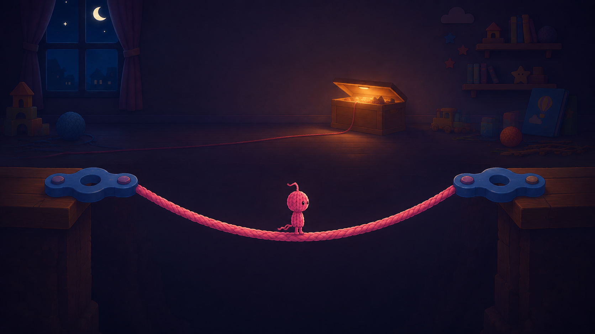

# ヒモヒト — Unity 2Dアクションパズル

自分の身体であるヒモを伸ばし、振り子で飛び、必要な場所ではそのヒモを足場として残して進む2Dアクションパズルです。

舞台は、子供が眠った後の夜の子供部屋です。ほどけかけたあみぐるみが、積み木、玩具レール、棚、懐中電灯などを越え、おもちゃ箱を目指します。

## この試作で確かめること

- 自分の身体を使って振り子で飛ぶ動きに爽快感があるか
- 次に使うヒモの長さを選ぶことで、移動前に考える時間が生まれるか
- ヒモを永久に足場へ変える判断が、残量を配分するパズルとして機能するか
- チュートリアル4区間と本編10区間の設計を通して、教える・試す・ひねるの順番が伝わるか

## 基本ルール

Sceneビューで見た目を確認する場合は、再生停止中に `HimoHito > Preview > Refresh Scene Visuals` で表示を更新できます。`Show Goal Chest` は更新して宝箱付近をSceneビューに表示します。ゲーム用カメラやリスポーン位置は移動しません。シーンを開いた直後・コード再読込後・再生終了後にも表示のみ更新します。

- ヒモを掛けて振り子移動するだけでは残量を消費しない
- 接続中に`E`を押すと、勢いを保ったままヒモを外す
- 接続中に`Q`を押した時だけ、選んだ長さを永久に消費して足場を作る
- Qで足場生成に成功した瞬間は、橋に沿って6〜12個の小さな毛糸片が舞い、約1秒以内に消える。見た目だけの粒子で、衝突判定はない
- Qで足場生成に成功すると、残量ゲージの中身が約0.22秒だけ暖かい白へ光り、元の残量色へ戻る。木枠・結び目は変わらない。接続・解除、生成失敗、Fでの統合、残量復元では発光しない。
- 着地音が鳴る着地では、空中に0.08秒以上いた場合に足元から5片の小さな毛糸が舞い、0.4〜0.6秒で消える。ヒモと同じ模様を使い、衝突や力の作用はない。歩行用の演出は追加しない。
- 足場用Hookでは、選んだ長さが対になった2つのHook間の実距離以上なら足場を作れる。資料の長さは攻略時の推奨値で、長くした分は消費とたわみが増える
- 足場は選んだ長さと両端の直線距離との差だけ下へたわむ
- 2本の足場が同じHookへ集まっている時、Hookへ照準を合わせて`F`を押すと、Hookを外して1本の足場へまとめる
- 本編第3区間の下ルートでは、毛糸のスイッチの近くで`F`を押すと帰り道の足場が現れる。出発側へ戻ると足場は再び隠れる。操作・足場用スクリプトは個別のファイルとGUIDで保存し、シーン読込時に参照を復元する。
- 残量は最低1以上残す必要がある
- 落下時は失敗画面で待機し、`R`で現在の区間から再開する。プレイ中の`R`でも再挑戦できる
- チェックポイント到達時の残量が次区間の最低必要量を下回る場合だけ、指定された下限まで補充する

振り子移動では`DistanceJoint2D`を使います。接続中の入力はHookを中心とする円の接線方向へ力を加え、解除時は速度を保存します。
接続成功時は主人公からHookへ約0.13秒でヒモが伸び、先端が届いた時に既存の接続音とリングの小さな揺れを出します。演出だけの遅延で、接続判定・ジョイント・振り子操作は従来どおり即時に有効です。途中で解除・足場化した場合は未再生の接続音を取り消します。リングの揺れは描画用の子だけに適用し、Hookの座標や当たり判定は動かしません。
プレイヤーから伸びる接続中のヒモと生成したヒモ橋には、主人公の頭の毛糸を参考にした同じピンクの撚り模様を使います。背景を読み込み時に除去し、模様を長さ方向に繰り返すことで引き伸ばしを防ぎます。Fで統合した橋にも同じ模様を適用します。照準線は従来のデザインのままです。残量に応じた接続ヒモの線幅、橋の太さ、たわみ形状、当たり判定は変えていません。
生成したヒモ橋は見た目の形を変えずに40点以上の連続した当たり判定で構成しています。プレイヤーの判定サイズと通常床を含む接地摩擦は従来の値を維持しながら、上り坂でヒモ橋の折れ目へ引っ掛かりにくくしています。入力なしでヒモ橋に立っている間は、摩擦を消さずに重力の斜面方向成分だけを相殺し、たわみの底へずるずる滑らないようにしています。
接続した直後にヒモがたるんでいる場合や、下Hookがプレイヤーより低い場合も、`A`/`D`の入力を左右へ進む接線方向の力へ変換して床の端から動き出せます。プレイヤーがHookより下へ回り、ヒモが張ると通常の振り子入力へ切り替わります。
下Hookへの接続直後は、接線の横成分が小さい角度でも床の摩擦に負けない起動力を加えます。力の向きはHookを中心とする円の接線のままなので、振り子の物理制約は変えません。
ヒモを接続できるのは青または緑の専用Hookだけです。床・壁・梁・生成済み足場・空中そのものは接続先にならないため、地形の角へ誤接続しません。第6区間では、青Hookから解除した直後に限り、空中から次の連続青Hookへ再接続できます。

## 操作

| 入力 | 操作 |
| --- | --- |
| `A` / `D` | 地上移動／振り子を加速 |
| `Space` | ジャンプ |
| `W` / `S` | 次に使う長さを1ずつ増減 |
| `←` / `→` | 照準を回転 |
| `↑` / `↓` | 照準を真上／真下へ合わせる |
| 未接続時に`E` | 照準先へヒモを掛ける |
| 接続中に`E` | 勢いを保ってヒモを外す |
| 接続中に`Q` | 現在のヒモを足場へ変える |
| 2本が集まるHookへ照準を合わせて`F` | Hookを外し、2本を1本へまとめる |
| `R` | 現在の区間から再挑戦 |
| チュートリアル開始床の看板付近で`Z` | その区間のイラスト付き説明を開く／閉じる |
| `Tab` | 操作ヘルプ |
| `Esc` | ポーズ |
| 失敗画面で`Esc` | タイトルへ戻る |
| タイトルで`Enter` | チュートリアルを開始 |
| タイトルで`Esc` | ゲームを終了 |

マウス照準は補助入力として使用できます。

## 数値の基準

- 地上最高速度：`6.5`
- 最大射出長：`14`
- ジャンプの目安：高さ`1.8`、横幅`3.2`、滞空時間`0.73`秒
- 振り子で届く距離の目安：選択長の`1.0～1.6倍`
- 本編開始残量：`50`
- 本編の必須消費想定：`44～45`
- クリア時の余裕想定：`5～6`

## チュートリアル — 4区間

1. **掛けて、振って、渡る**：下まで続く2つの地形を置き、中央上のHookへ掛ける。初期選択長は6だが、T1から`W/S`で変更でき、矢印キーで照準方向も選べる。プレイヤーの開始位置は床上面と当たり判定の高さから算出し、わずかに接地側へ入れて空中開始を防ぐ。長さ6なら掛けた瞬間は床に立ったままで、歩き出した時に振り子になる。着地床は従来位置から右へ4広げ、長さ9前後を選ぶことで到達できる。着地時はヒモを強制解除せず、接続状態と勢いを保ったままT2へ進む。`Q`はまだ教えない。旧チュートリアル由来のHook・床・ゴール・懐中電灯ギミックはシーンから削除し、落下時は失敗画面で入力を待ち、`R`で現在区間のチェックポイントへ戻る。ヒモは減らない
2. **長さを選ぶ**：T1の着地床を左岸として対岸と中央Hookを置く。対岸の中心はX=`27`で、旧位置から右へ3移動している。初期長さ8ではプレイヤーの足元が木製トゲへ約0.72入り、長さ7では約0.28上を通り、長さ6でも振り幅を作れば対岸へ届く。T1から接続を保って入った場合は`E`で外し、`W/S`で6または7へ選び直して渡る。対岸の上面へ着地した時だけT3の復帰地点を記録し、壁側面への接触では更新しない。失敗してもヒモは消費しない
3. **ヒモを足場にする**：T2右岸の右端X=`30`と新しい右岸の左端X=`36`を使い、頭上に振り子用Hookがない谷幅6を作る。両岸の内側端には本編と同じ緑色の足場用フックを置く。谷の手前から対岸の緑フックへ長さ6で`E`接続し、`Q`で2つの緑フック間を直線に近い足場で結ぶ。岸端に立つプレイヤー中心と固定点のずれは、全足場用Hook共通の照準補助0.5で吸収する。チュートリアル開始残量99から6を永久消費して93になり、右岸上面へ着地した時だけT4の復帰地点を記録する
4. **Hookを外してまとめる**：資料T5を、本編に対応する内容がない旧T4の代わりに最終区間として繰り上げる。T3右岸の右端X=`42`から中央Hook、右岸の左端X=`52`までを、長さ6の足場2本で結ぶ。通しプレイでは残量93から12を消費して81になる。左側の足場を作った後は、中央Hookを`E`の接続候補から外して右の緑Hookを狙えるようにする。中央Hookは`F`の対象として残る。2本のままでは吊り梁に当たるが、中央の青Hookへ照準を合わせて`F`で外すと、両端距離10・総長12・たわみ2の1本になり、梁の下を通ってゴールできる

区間1から`W`/`S`と矢印照準を使用し、区間3から`Q`、区間4で`F`を使用します。
各区間の開始床には、三枚板と一本脚にピンクのヒモを結んだ木製の看板があります。看板の近くで`Z`を押すと、現在の区間だけに必要な操作と正解例をイラスト付きで確認できます。説明中は物理と操作を一時停止し、もう一度`Z`を押すと同じ状態から再開します。
看板の接続ヒモとヒモ橋もゲーム本体と同じ毛糸模様です。振り子の軌道線は模様を付けず、T4では統合前の橋を薄く表示して統合後の橋と区別します。

## 本編 — 区間設計（第8区間は削除、第10区間まで実装）

1. **基本の再確認**：長さ7で掛けて振り、着地する
2. **長さの窓**：Hookへ届くだけでなく、手前と奥のトゲを避けられる長さ6を選ぶ
3. **二段Hook**：上下2つのHookから、長さと着地点を考える。上Hookは長さ8でX=53.6の高い棚へ進む。下Hookは開始床より2.7高い位置（X=38.2、Y=-1.65）にあり、長さ6で低い行き止まりへ着地する。床の玩具スイッチを`F`で押すと帰りの段差が出て、開始床へ戻ると消える
4. **届かない対岸**：第3区間の棚右端から遠い青Hookへ直接長さ13で掛けると、最下点Y=-10.45まで落ちて対岸へ届かない。左岸と柱上の緑色の足場用Hookは対になっており、両端は横4.7・上1.5（直線距離約4.93）離れている。右の緑Hookへ長さ5で接続して`Q`を押すと、通常ジャンプでは届かない中継柱へ歩ける足場ができる。柱上から`(72.6,2.55)`の青Hookへ長さ9で掛けて対岸へ渡る。緑色は2点を結ぶ橋作成用、青は振り子用を示し、足場化で残量を50から45へ減らす最初の本編区間
5. **懐中電灯を遮る**：第4区間の壁床右端`X=87.1`と左端を揃えた青いレール棚へ進み、棚の内側にある2つの緑Hookを足場で結ぶ。棚間4.4へ届く長さなら生成でき、推奨の長さ6ではたわみ1.6になって光源の真下を遮光する。光が0.4秒で暗くなったら、谷側の青Hook`(97.0, 2.95)`へ長さ7で掛けて右岸へ渡る。棚2枚は未接続時と緑の橋作成Hookへの接続中には上に立てるが、青い振り子Hookへの接続中は軌道を妨げないようプレイヤーとの衝突がなくなる。`R`または落下で再挑戦した時は、2枚とも本体・当たり判定・レール画像を即座に復元する。右棚端から右岸までは約8.6空け、通常ジャンプの近道を防ぐ。茶色い取付ブロックは青Hookの真上に揃え、遮光判定用の見えない起点だけを橋中央に残す。旧構成の第7区間Hookは第5区間内に重なるため非表示にする
6. **配分の分かれ道**：第5区間右岸の端から分岐する。棚とフック群は開始床より上へ離し、右方向へ合計8広げて配置する。上は緑Hookへ長さ14で接続して`Q`で約25度の安全橋を作り、3枚の棚をジャンプして合流床へ進む（消費14）。下は長さ8で最初の青Hookへ接続し、棚の下に横一列で並ぶ3個の青Hookを順に振り継いで合流床へ着地する（消費0）。第6区間の青Hookから解除した時だけ1.5秒間、同じ連続フックの次の番号へ空中再接続できる。受付中に次のHookが選択長の射程へ入った状態で`E`を押すと自動選択するため、空中で細い照準線を重ねる必要はない。青Hookは緑Hookへの射線を遮らず、上の棚と振り子軌道が干渉しない高さに分離する。合流床の上面は第5区間右岸と同じY=-2.15に揃える。合流チェックポイントの補充下限は25なので、上ルートの残量25と下ルートの残量39の差をそのまま保存する。途中で落下または`R`を押すと第6区間の開始地点へ戻る
7. **先に、作る**：第6区間の合流床から中段へ長さ4の足場を先に作り、中段から上面差1.2の上段へジャンプしてから、上段の青Hookへ長さ5で掛けて対岸へ渡る。合流床から青Hookへ直接掛けると長さ14の最下点が落下判定より下へ入る。第6区間で選んだルートに関係なく、緑Hookへ接続して`Q`を押した時だけ最初の足場を生成し、選択長を消費する
8. **削除**：垂れた足場の底へ降りる構成は、足場の当たり判定が通路そのものを塞いでゲームが成立しないため採用しない。第7区間のチェックポイントから第9区間へ直接進む
9. **外して、抜ける**：中央Hookを両岸より1.1高く置き、左岸から中央Hook、中央Hookから右岸へ長さ6の足場を2本作る。各区間の直線距離5.61に対してたわみは約0.39で、2本目の橋作成用Hookへ接続した時は、プレイヤーの現在位置までの微小な距離超過を物理ヒモだけに許し、`Q`前に橋端から引き落とさない。2本のまま歩くと低い梁に当たる。中央Hookへ照準を合わせて`F`で外すと、両端間11・総長12・たわみ1の1本へ統合され、足場の底が下がって梁の下を抜けられる
10. **最後の橋**：第9区間右岸の右端と9離れた最終右岸を、長さ10・たるみ1の足場で結ぶ。頭上に振り子用Hookはなく、両岸の緑Hookだけを使う。通常は残量15から10を消費して残り5でおもちゃ箱へ着く。残量が少ない場合だけ区間開始時に11まで補充し、長さ10を必ず選べる状態を保証する

## 床と障害物

- 本編の通常床・壁床・着地床は、チュートリアルと同じ木製ブロック画像を使う。大きな地形は画像1枚を横へ引き伸ばさず、最大幅7.5ごとに木製ブロック列を繰り返して模様の密度を保つ。青いレール床、ピンクのヒモ足場、赤いトゲは機能を見分けられる現在の色と形を維持する
- ステージに最初から置かれた床・棚・梁・壁は、振り子中も上下左右から衝突する
- 青いHookは横棒付きの振り子用、緑のHookは中央の輪だけを残した2点式の足場作成用として見分ける。どちらも接続判定だけを持つ固定点として扱い、未接続時も振り子中もプレイヤーの移動を物理的に遮らない
- ヒモの接続先は青または緑の専用Hookだけとし、床・壁・梁・生成したヒモ足場・空中そのものには接続できない
- プレイヤーが空中にいること自体は禁止条件ではない。第6区間の青Hook連続ルートでは、解除後1.5秒以内に次の青Hookへ再接続できる
- 生成したヒモ足場は通常時に歩ける。歩行中は足元の局所的な傾斜に沿って地上速度を補正し、たわみの底を越えた時の慣性で橋から浮かないようにする。上り坂で接触点がColliderの端へ移っても、橋が実際に足元を支えている間は接地を維持する。足場作成用Hookへ`E`で接続した時は振り子へ移行せず、その位置を`Q`で足場化するか`E`で解除するまで保持する。接続中はすべての生成済み足場との衝突も維持する。振り子用Hookへヒモ足場の上から接続した場合は、足場を離れるまで衝突を維持し、離れた後は無効にして振り子軌道を妨げない
- 赤い木製玩具の三角トゲや懐中電灯へ接続中のプレイヤーが触れると、ヒモが外れて落下する

## ヒモ残量の見せ方

残量は数字とゲージで表示します。見た目の身体は残量に応じて4段階に小さくなりますが、Rigidbody2DとCollider2Dの大きさは変えません。操作性を変えずに「自分の身体を使っている」ことだけを伝えるためです。

## シーン

- `Assets/Scenes/Tutorial.unity`：4区間のチュートリアル
- `Assets/Scenes/MainStage.unity`：第8区間を除き、第10区間まで実装済みの本編

シーンを資料の初期配置へ再構築するメニュー：

- `HimoHito > Rebuild Implemented Stages From 0829 Manual`（チュートリアルと実装済み本編を一括再構築）
- `HimoHito > Rebuild Tutorial`
- `HimoHito > Clean Tutorial Legacy Objects`（旧チュートリアルの床・Hook・ゴールを削除）
- `HimoHito > Rebuild Main Stage Through Section 10`
- `HimoHito > Clean Main Stage Legacy Objects`（旧区間とMissing Scriptを整理）

## Unity Editorでの実行

1. Unity Hubでこのフォルダをプロジェクトとして追加する
2. Unity `6000.3.21f1`で開く
3. `Assets/Scenes/Tutorial.unity`を開く
4. Playを押す

起動時は第7回資料に沿った専用タイトル画面を表示します。`Enter`でチュートリアル開始、`Tab`で操作説明、`Esc`で終了します。チュートリアルクリア後は`Enter`で本編へ進みます。
操作説明は同じ子供部屋の画風で描いた白紙の工作用紙へUnity側で操作表を重ね、ゲーム中に開いた場合は閉じるまで進行を一時停止します。
失敗・クリア演出・クリア画面では通常プレイ用の操作案内とTab／Escのポーズ処理を止め、各結果画面の操作を優先します。看板や操作説明、ポーズの表示中も通常の右上案内は重ねません。
通常の子供部屋背景のさらに奥には、暗くぼかした壁面・窓・本棚の遠景を3枚つないで配置しています。遠景はカメラ移動の78%で追従し、左右の複製を反転して継ぎ目を一致させることで、長い本編でも背景の端を見せずに奥行きを出します。
本編とチュートリアルのクリア画面には、細くなった主人公がおもちゃ箱へ帰る共通のエンディング背景を表示します。本編では残量・編んだ足場・補充回数・クリア時間を画像の上へ重ねます。
ヒモが尽きた時と落下した時は、床に残った短いヒモと遠いおもちゃ箱を描いた共通の失敗画面を表示します。画面は自動で切り替わらず、`R`で現在区間から再挑戦し、`Esc`でタイトルへ戻れます。
Play時は`Tutorial.unity`のT1先頭から、残量99・選択長6・生成済み足場なしで開始します。最初からやり直した場合も同じ状態へ戻ります。チュートリアルをクリアすると本編へ進みます。

本編は`MainStage.unity`の第1区間から、残量50・選択長7・生成済み足場なしで開始します。落下時と`R`での再挑戦も、到達済みの現在区間のチェックポイントへ戻ります。

Windows配布版はZIPを展開し、ルートにある`START_HIMOHITO.bat`から起動します。Unity 6.3の第2シーン読み込みが日本語を含む実行パスで停止する環境があるため、ランチャーがゲーム本体を`C:\Users\Public\HimoHitoPrototype`へコピーしてから起動します。`Game`フォルダ内のexeは直接起動しないでください。配布版は全画面で開始し、`Alt + Enter`でウィンドウ表示と切り替えられます。

## Windows版を作成

1. Unity上部メニューの`HimoHito > Build Windows Prototype`を押す
2. `Builds/Windows/Game/HimoHitoPrototype.exe`が作成されるまで待つ
3. `Builds/Windows`フォルダを一式ZIPにして共有する。展開後は`START_HIMOHITO.bat`から起動する（exe単体では共有しない）

ビルド直前に第7回資料の提出用設定を自動適用します。
Windows版は主人公アイコン、Company Name=`bq24014-cmd`、Product Name=`ヒモヒト`、
既定解像度は1920×1080、起動モードは全画面ウィンドウ（FullScreenWindow）です。
スプラッシュは濃紺背景に主人公ロゴを2秒表示する設定とし、Unityロゴ表示も有効にしています。
ウィンドウ表示への切り替えには`Alt + Enter`を使います。

## 主なコード

| ファイル | 役割 |
| --- | --- |
| `Assets/Scripts/RopeResource.cs` | ヒモ残量の唯一の管理元 |
| `Assets/Scripts/RopeController.cs` | 照準、接続、解除、ヒモ描画 |
| `Assets/Scripts/RopePlatformBuilder.cs` | Qによる足場化、FによるHook除去と統合 |
| `Assets/Scripts/PlayerMover.cs` | 地上・空中・振り子中の移動 |
| `Assets/Scripts/PrototypeRunController.cs` | チュートリアルの進行と再挑戦 |
| `Assets/Scripts/MainStageRespawnOnFall.cs` | 本編の区間進行、資源下限、再挑戦 |
| `Assets/Scripts/SceneObjectLookup.cs` | 非アクティブを含むシーン内オブジェクト検索の共通処理 |
| `Assets/Editor/PrototypeSceneBuilder.cs` | チュートリアル4区間の再構築 |
| `Assets/Editor/MainStageSceneBuilder.cs` | 本編の実装済み区間の再構築と旧オブジェクト整理 |

## 素材とライセンス

### BGM「優しい踊り」

- 曲・作曲者：優しい踊り / GANO（DOVA-SYNDROME）。[公式配布ページ](https://dova-s.jp/bgm/detail/3126)、[作曲者条件](https://dova-s.jp/creator/detail/89)、[音源利用ライセンス](https://dova-s.jp/help/articles/license/)、[サイト規約](https://dova-s.jp/help/articles/terms/)。2026-09-07確認、作曲者条件はサイト準拠。
- タイトル・Tutorial・MainStageで1曲を繰り返す。専用AudioSourceがシーン間を引き継ぎ、通常のリトライでも曲を頭から再開しない。専用ループ素材ではないため原曲の終端から先頭へ戻る仕様。
- 通常音量0.35、タイトル0.25、ポーズ/説明0.15、失敗0.10、クリア演出中0.07へフェードする。効果音と物理・残量には触れない。
- 音源単体の再配布を避けるため、`Assets/Resources/Audio/YasashiiOdori.mp3`はGit管理外。.metaと再生コードのみ共有する。新しいPCでは公式ページのトラック1をダウンロードし、この名前で配置してUnityにインポートする。欠落時はビルド検査で停止する。
- 配布はUnityが変換・組み込みしたゲーム本体のみ。生のMP3をGitHub、共有ZIP、StreamingAssetsへ含めない。取得ファイルSHA-256：`25C52DA234D42C7A5E5CC91D45AEED14829F845EA15932A88AC94AB006781E83`。

### 効果音・フォント

- ヒモ射出音：効果音ラボ「衣擦れ2」
  （`https://soundeffect-lab.info/sound/various/various3.html`）
- ヒモ掛け損ね音：効果音ラボ「パンチの素振り1」
  （`https://soundeffect-lab.info/sound/battle/`）
- 投入長変更音：効果音ラボ「決定ボタンを押す31」
  （`https://soundeffect-lab.info/sound/button/`）
- 投入長の上限・下限音：効果音ラボ「ブロックを置く」
- プレイヤー着地音：効果音ラボ「ジャンプの着地」
  （`https://soundeffect-lab.info/sound/search.php?s=%E7%9D%80%E5%9C%B0`）
- ゴール演出音：効果音ラボ「宝箱を開ける」の0.45秒後に「決定ボタンを押す29（木琴の生演奏）」を鳴らし、木琴と同時にクリア画面を表示
- ヒモ切れ失敗音：効果音ラボ「脱いだ服を落とす」を主音量0.72で鳴らし、0.18秒後に「ピアノの単音」を音量0.14で重ねる。落下による失敗では鳴らさない
- UIを開く音：効果音ラボ「紙を広げる1」。`Tab`の操作説明、`Z`の区間看板、`Esc`のポーズを開いた時に共通で鳴らす。閉じる時は無音（2026-09-07確定）
- 効果音ラボ利用条件：無料・商用利用可・加工可・クレジット表記不要
- ジャンプ音：Kenney「Impact Sounds 1.0」の`footstep_carpet_002.ogg`
- 歩行音：同`footstep_carpet_000/003/004.ogg`をランダム再生。候補2の`001`は打音が強いため不採用
- 足場生成音：同`impactPlank_medium_003.ogg`
- Hookを外して足場を統合する音：同`impactWood_light_004.ogg`
- Hook接続音：Kenney「Impact Sounds 1.0」
- ライセンス：Creative Commons Zero（CC0 1.0）
- 同梱ライセンス：`Assets/ThirdParty/KenneyImpactSounds/License.txt`
- UIフォント：Google Fonts「M PLUS Rounded 1c」Regular / Bold
- ライセンス：SIL Open Font License 1.1
- 同梱ライセンス：`Assets/ThirdParty/MPlusRounded1c/OFL.txt`

第7回資料のUI方針に合わせ、タイトル、HUD、操作説明、クリア画面、
ステージ内の案内表示はすべて同じフォントファミリーを使います。
フォントはUnityプロジェクトに同梱し、実行するPCのフォント環境に依存しません。
ヒモ残量ゲージの木製枠と結び目、操作ボタンには、
Part D画像⑥の共通素材を使い、素の矩形だけがゲーム画面から浮かないようにしています。
本編とチュートリアルの通常フックも同じ青い接続リングへ統一しています。
足場生成用のフックは円形を共通にしたうえで、役割が分かる緑色を維持します。

`Assets/Resources`には、実行時に読み込む現行素材だけを置きます。比較用だった旧画像
`HimoHitoWalk-v1/v2`、`HimoHitoJump-v1`、`HimoHitoSwing-v1`、
`TutorialToyBoxGoal-v1`はGit履歴から確認できるため、現行アセットから外しています。
未使用の空の`Assets/Tests`フォルダーも置いていません。

操作感、配置変更、選択理由、成功回数は[`Docs/LEARNING_LOG.md`](Docs/LEARNING_LOG.md)と[`Docs/METRICS.md`](Docs/METRICS.md)に記録しています。

## 使用バージョン

- Unity `6000.3.21f1`
- Built-in Input Manager
